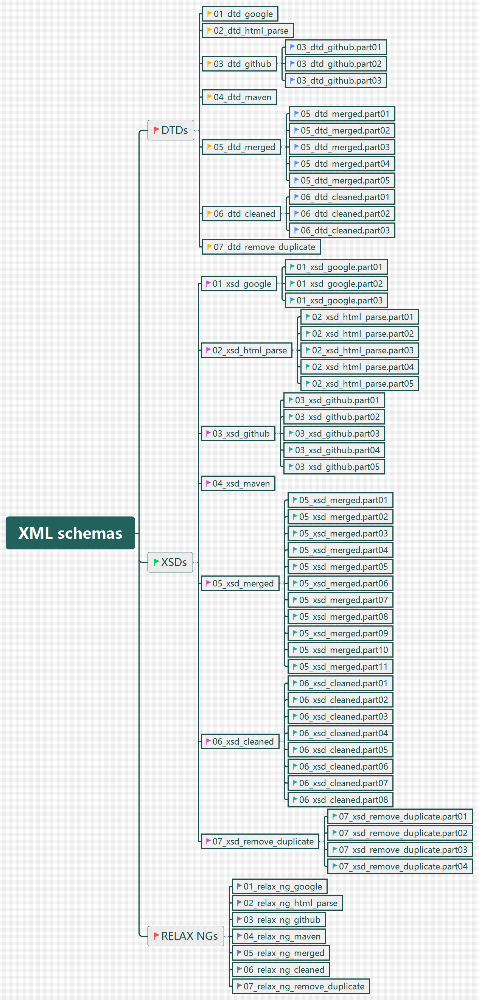

# Practical Study of Subclasses of Regular Expressions from XML

### XML schemas (Section 3)

#### Introduction

This GitHub repository holds XML schemas mentioned in ***Practical Study of Subclasses of Regular Expressions from XML*.** 

To **download** the repository go to https://github.com/clRE/XMLSchemas 

### View

### 

